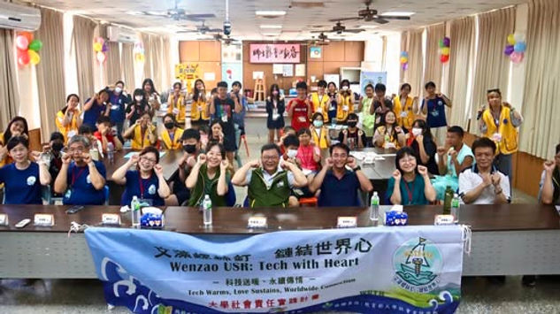

# 活動紀錄 Activities

## 2025 蚵寮 AI 永續探索營

!!! quote "營隊理念"
    這不只是一場營隊，更是一場陪伴。

    我們希望讓蚵寮的孩子們，認識生長的土地，說出家鄉的故事。

由【文藻螺絲釘‧鏈結世界心】USR 團隊精心策劃，透過 AI 工具、手作創作與主題學習，帶著孩子們重新看見蚵仔寮的美，也學會如何把故事「說」出來、「做」出來！

### 營隊特色

我們將帶著蚵寮的孩子們，一起：

- 用 AI 生成音樂，寫出一首「家鄉歌」
- 用 AI 創作影片，敘說一段「家鄉事」
- 用回收的寶特瓶，手作一盞「家鄉燈」

成果發表會時，孩子們將站上講台，練習自信地表達自己的創作與想法。

---

### 主題學習

#### 主題一｜人文歷史

從插蚵到烏金，寫下蚵仔寮的產業記憶。

蚵仔寮，這座靠海的小漁村，有著近三百年的漁業記憶。清康熙年間，來自福建與漳州的移民在此築寮養蚵，形成「蚵ㄚ寮」聚落。日治時期，因軍港徵收與海岸侵蝕，蚵業式微，漁民轉向烏魚捕撈，一度創下「烏金淹腳目」的繁華盛景。

#### 主題二｜捕魚技藝與信仰文化

蚵寮人的海上智慧與敬天心。

每年冬至前後，烏魚成群洄游至台灣西南沿海產卵。蚵仔寮漁民世代發展出獨具匠心的捕魚技藝，如「牽罟」以岸邊眾人合力拉網圍捕；「雙頭船」兩艘漁船協同圍網，迅速收攏魚群；「跳活烏魚」把握魚群驚擾躍出水面的剎那，以手網俐落撈取。

#### 主題三｜地理與自然

從潟洲地形說起，看見沉沒的聚落與未來的省思。

蚵仔寮所處的海岸為潟洲地形，雖適合發展漁業與養殖，但極易受到海浪侵蝕、地層下陷與颱風侵襲。蚵仔寮的海岸線變遷，訴說著自然的無情與地貌的流變，我們會帶著孩子們一起瞭解地形的脆弱，喚起人們對海洋與土地的省思。

---

### 校長回饋

> 蚵寮國中李娟娟校長說：「超讚的！」

> 蚵寮國小陳麗鈞校長說：「看著隊輔預製的影片，有種莫名的感動，期待文藻大手攜蚵寮小手，學習用 AI 來展現蚵寮的海岸聚落人文風情。」

---

### 相關影片

- [:material-youtube: 營隊開幕影片](https://youtu.be/E_JgudXUH0k)
- [:material-youtube: 營隊閉幕影片](https://youtu.be/Yb3AbLhPZ3E)
- [:material-youtube: 蚵生感言影片](https://reurl.cc/ekv3Ax)

---

## 營隊團隊

營隊總召暨 AI 音樂與影片製作授課老師：吳紹慈老師

營隊學生幹部：

- 總召 - 周筠恩
- 活動 - 王育靖
- 生活 - 郭星妤
- 文書 - 郭佳緰

環保手作燈飾授課老師：周春曉

---

## 更多影片

- [:material-youtube: 線上英文陪伴 - 3/19 蚵寮啟航，5/21 完美收航](https://reurl.cc/Om7AoX)
- [:material-youtube: 歡樂收割日 - 小螺絲釘期末慶祝大會](https://reurl.cc/ax04oG)
- [:material-youtube: 大海裡的家 - 動態繪本](https://reurl.cc/rYd6ME)
- [:material-youtube: 寄居蟹的時尚災難 - 動畫影片](https://reurl.cc/RknyAz)
- [:material-youtube: 我們一起走過 113-2](https://reurl.cc/ax043Q)

---

## 追蹤最新活動

[:fontawesome-brands-facebook: Facebook](https://fb.wzuusr.org){ .md-button }
[:fontawesome-brands-instagram: Instagram](https://ig.wzuusr.org){ .md-button }
[:fontawesome-brands-youtube: YouTube](https://yt.wzuusr.org){ .md-button }
