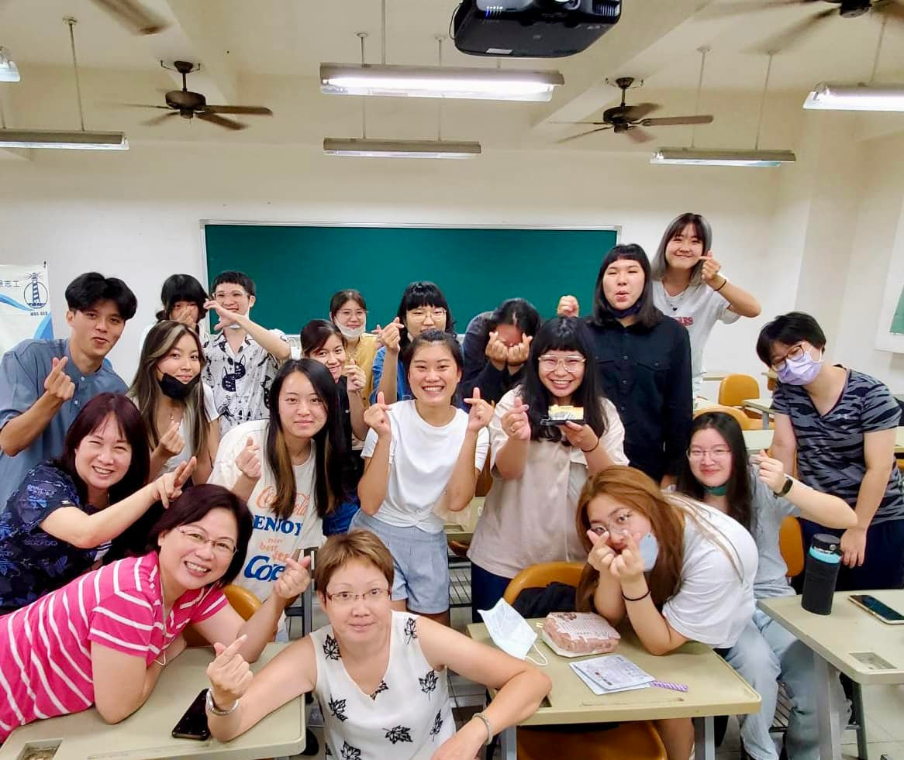

# 新學期新氣象，小螺絲釘繼續向前走

新學期開始，小螺絲釘團隊整裝待發，繼續為社會貢獻心力。

<!-- more -->

## 新學期展望

隨著新學期的到來，小螺絲釘團隊也迎來新的夥伴與挑戰。

### 新成員招募

本學期成功招募多位新志工，為團隊注入新活力：
- 來自各系所的熱血學生
- 對服務學習充滿熱忱
- 具備不同語言專長

### 培訓計畫

為新成員規劃完整的培訓課程：
1. **基礎訓練**：了解計畫宗旨與服務內容
2. **專業技能**：口譯技巧與醫療用語
3. **實務演練**：模擬服務情境
4. **場域參訪**：認識合作醫院

## 服務規劃

本學期預計執行的服務項目：
- 醫院口譯志工服務
- 雙語繪本推廣活動
- 線上國際交流課程
- 社區衛教宣導

## 期待

期待新舊成員攜手合作，讓小螺絲釘的服務精神持續發光發熱！
