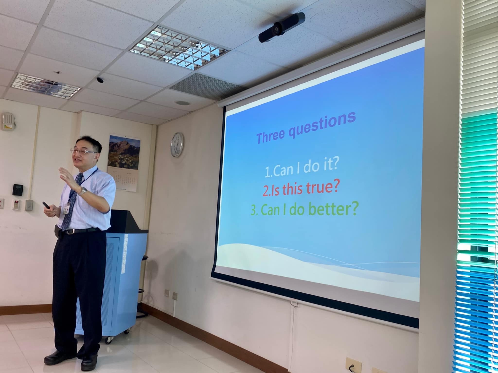

# 小螺絲釘教師社群心靈饗宴

教師社群舉辦心靈饗宴活動，凝聚團隊向心力，分享教學經驗。

<!-- more -->

## 活動宗旨

教師社群不只是工作夥伴，更是互相支持的成長團體。本次心靈饗宴旨在：

- 促進教師間的交流與對話
- 分享服務學習教學心得
- 探討跨領域合作的可能性
- 凝聚團隊向心力

## 活動內容

### 主題分享

邀請資深教師分享服務學習融入課程的經驗，以及如何引導學生反思。

### 小組討論

分組討論各系所的合作機會，探索更多跨領域教學模式。

### 心靈對話

透過引導式對話，讓教師們分享內心的感受與期待。

## 收穫與展望

參與教師紛紛表示，這樣的活動讓他們更了解彼此，也對未來的合作充滿期待。

> 「一個人走得快，一群人走得遠。」
