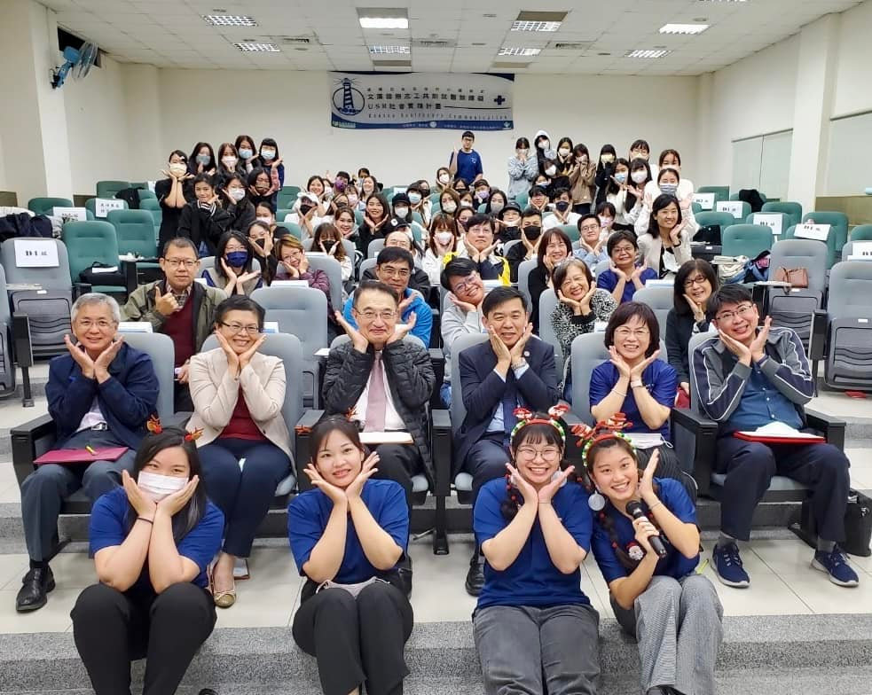

# 第十次期末慶賀及反思大會

文藻「溫暖白色巨塔的小螺絲釘 USR 計畫」於 12 月 15 日晚間，隆重舉辦第十次的期末慶賀及反思大會。

<!-- more -->

## 活動意義

每學期末的慶賀與反思大會，是小螺絲釘團隊的重要傳統。這不只是慶祝活動，更是一個回顧與展望的時刻。

## 活動流程

### 服務回顧

各組志工分享本學期的服務經歷與感動時刻。

### 反思分享

引導學生進行深度反思：
- 這學期最大的收穫是什麼？
- 遇到什麼挑戰？如何克服？
- 對未來服務有什麼期待？

### 頒獎表揚

表揚本學期表現優異的志工與團隊。

### 溫馨共餐

所有成員共同享用晚餐，在歡樂的氣氛中為本學期畫下完美句點。

## 展望未來

新的學期即將到來，期待更多夥伴加入小螺絲釘的行列！
