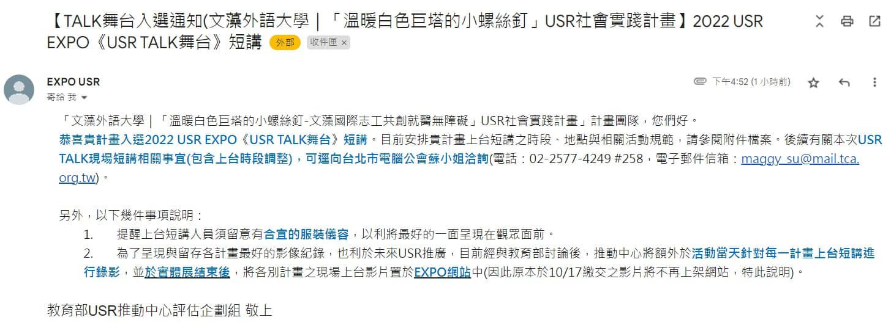

# 恭喜本計畫團隊 USR Talk 入選 2022 USR EXPO 舞台

本計畫團隊 USR Talk 入選了 2022 USR EXPO《USR TALK 舞台》，展現文藻小螺絲釘的服務成果與精神。

<!-- more -->

## 活動紀實

2022 USR EXPO 是教育部推動大學社會責任實踐計畫的重要展示平台，讓全國大專院校分享其 USR 計畫成果。

本計畫「溫暖白色巨塔的小螺絲釘」以獨特的多語醫療口譯服務，以及對新住民、移工的關懷，獲得評審青睞，成功入選 USR TALK 舞台。

### 成功關鍵

1. **跨領域合作**：結合多系所教師專業
2. **實際影響力**：服務真實社會需求
3. **永續經營**：建立長期合作夥伴關係
4. **學生成長**：培育具備社會責任的人才

## 感謝

感謝所有團隊成員的努力，以及合作夥伴的支持！
