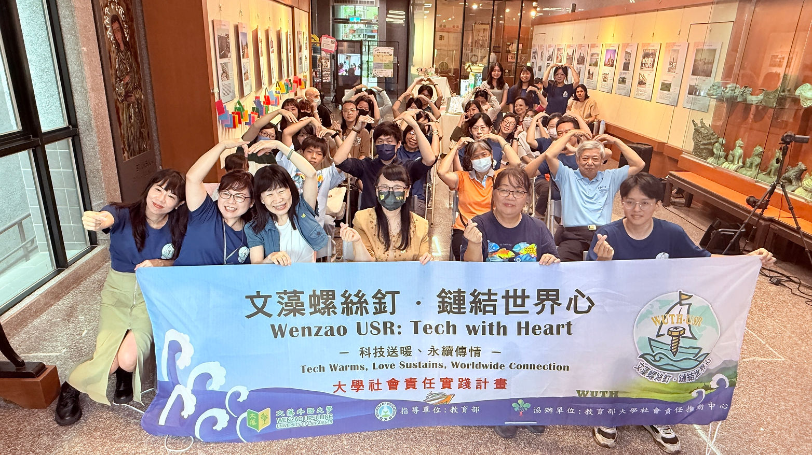
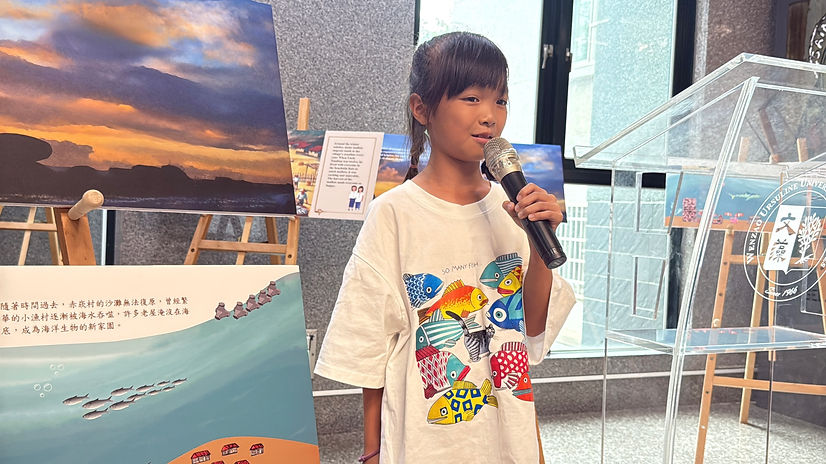
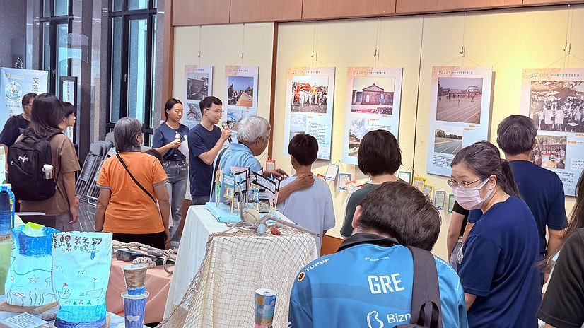
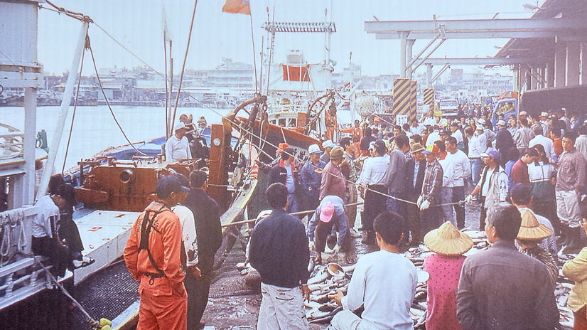
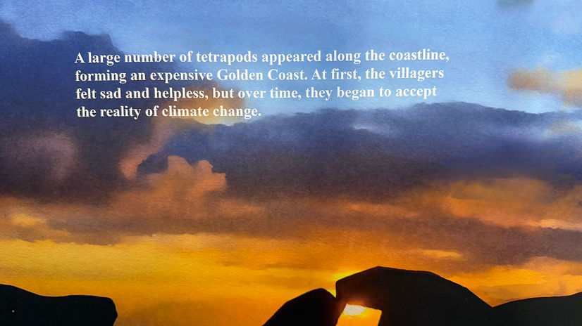
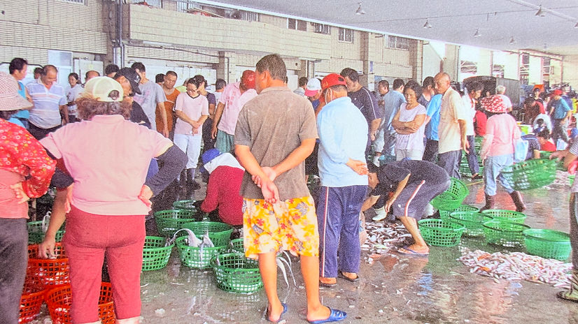
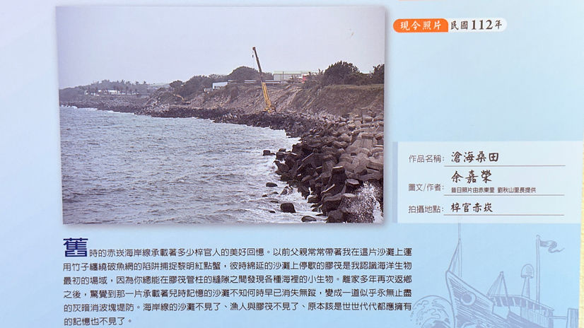

# 2025 蚵寮 AI 永續探索營

文藻小螺絲釘前進蚵寮，舉辦 AI 永續探索營，結合科技與在地文化。

<!-- more -->

## 活動簡介

2025 年，文藻小螺絲釘計畫前進高雄蚵寮社區，舉辦為期一日的「AI 永續探索營」，讓學生認識在地文化的同時，也接觸 AI 科技的應用。

## 營隊內容

### AI 認識課程

- AI 基礎概念介紹
- 生活中的 AI 應用
- 動手體驗 AI 工具

### 在地文化探索

- 蚵寮漁村歷史
- 養蚵產業介紹
- 社區導覽

### 永續議題討論

- 海洋生態保育
- 漁村永續發展
- 科技如何協助永續

## 活動精彩花絮

## 學習成果

參與學生透過營隊：
- 認識 AI 科技的實際應用
- 了解在地社區的文化與產業
- 思考如何運用科技促進永續發展

## 未來展望

這次營隊是文藻 USR 計畫社區服務的新嘗試，期待未來能持續深耕在地，為社區帶來更多正面影響。
