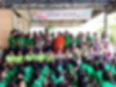

# 實踐場域 Practice Fields

## 服務場域總覽

文藻 USR 計畫在多個場域實踐大學社會責任，結合外語專業提供志工服務。

---

## 醫療場域

### 義大醫院

與義大醫院合作，提供外籍人士、新住民及移工就醫口譯服務，共創就醫無障礙環境。

### 高雄榮民總醫院

進駐高雄榮總，協助外籍病患就醫溝通，提升醫療服務品質。

### 小港醫院

與小港醫院合作，服務鄰近區域的外籍人士與移工。

---

## 教育場域

### 蚵寮國小

服務高雄蚵寮地區國小學童，提供英文教學與課後陪伴。

### 蚵寮國中

與蚵寮國中合作，推動英語教育與永續發展主題課程。

---

## 國際場域

### 馬來西亞沙勞越 Sarawak

透過線上課程服務馬來西亞沙勞越地區學童。

### 柬埔寨 Cambodia Green Umbrella KKS

疫情期間持續透過線上方式服務柬埔寨弱勢學童。

### 尼泊爾 Nepal

國際志工服務據點。

### 越南 Vietnam Operation Smile

與國際微笑行動組織合作的服務據點。

---

## 產業合作

### 前鎮加工區 - 瑞儀光電

產業志工服務據點。

### 安平工業區 - 黑橋牌企業

產業志工服務據點。

---

## 在地學校

- 旗山國小
- 立德國中

---

## 加入服務

想參與志工服務？歡迎加入小螺絲釘團隊！

[:material-arrow-right: 查看招生資訊](join.md){ .md-button .md-button--primary }
