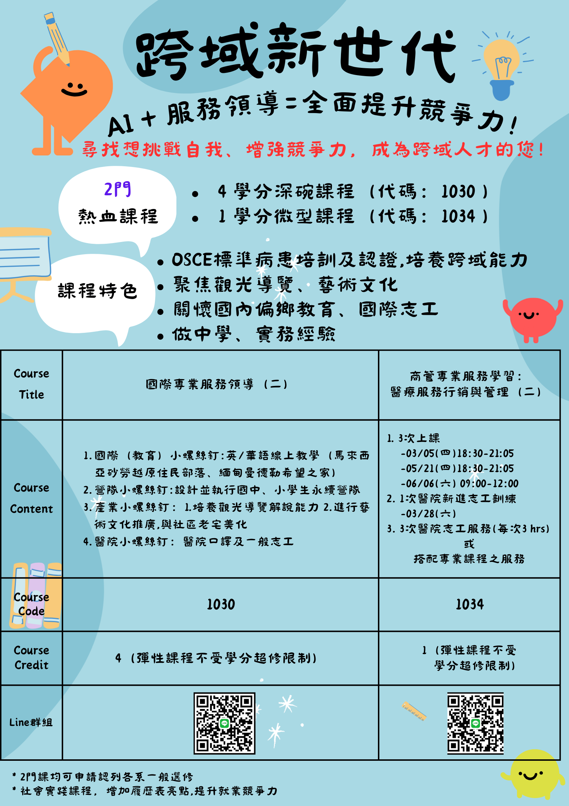

# 招生資訊 Join Us

<h2>文藻螺絲釘 鏈結世界心</h2>
<h3>114-2 火熱開課</h3>

---

## 課程報名

<a href="https://join.wzuusr.org/" target="_blank">https://join.wzuusr.org/</a>

---

## 加入我們

尋找想挑戰自我、增強競爭力，想成為跨域人才的你！

!!! success "邀請函"
    小螺絲釘 USR 團隊誠摯邀請您成為**跨域新世代人才**：

    **AI + 服務領導 = 全面提升競爭力！**

加入小螺絲釘團隊，與我們一同以熱情回應世界與台灣社會的真實需求！

---

## 課程資訊

團隊用心規劃以下課程：

| 課程類型 | 學分 | 選課代碼 |
|---------|------|----------|
| 深碗課程 | 4 學分 | 1030 |
| 微型課程 | 1 學分 | 1034 |

!!! note "選課時間"
    **第二學期初選選課**：2025.12.30 - 2026.01.02

---

## 課程特色

- :material-check-circle: 培養跨域能力
- :material-check-circle: 結合 AI 與服務學習
- :material-check-circle: 聚焦永續營隊、國際志工、文化與藝術導覽及醫院志工
- :material-check-circle: 做中學，累積實務經驗
- :material-check-circle: 邁向世界公民之路！

---

## 宣傳海報

<figure markdown>
  { width="600" }
  <figcaption>114-2 課程宣傳海報</figcaption>
</figure>

---

## 學姊分享

聽聽學姊怎麼說：

<iframe width="560" height="315" src="https://www.youtube.com/embed/dQw4w9WgXcQ" title="學姊分享" frameborder="0" allow="accelerometer; autoplay; clipboard-write; encrypted-media; gyroscope; picture-in-picture" allowfullscreen></iframe>

---

## 走過的路：更多影片與分享

- [:material-youtube: 2025 蚵寮 AI 永續探索營 - 蚵生感言](https://reurl.cc/ekv3Ax)
- [:material-youtube: 線上英文陪伴 - 3/19 蚵寮啟航，5/21 完美收航](https://reurl.cc/Om7AoX)
- [:material-youtube: 歡樂收割日 - 小螺絲釘期末慶祝大會](https://reurl.cc/ax04oG)
- [:material-youtube: 大海裡的家 - 動態繪本（師生作品）](https://reurl.cc/rYd6ME)
- [:material-youtube: 寄居蟹的時尚災難 - 動畫影片（師生作品）](https://reurl.cc/RknyAz)
- [:material-youtube: 我們一起走過 113-2](https://reurl.cc/ax043Q)

---

## 課程大綱

### 深碗課程（4 學分）

課綱製作中，完成後更新。

[下載深碗課程大綱 PDF](assets/join/deep_bowl_syllabus.pdf){ .md-button }

### 微型課程（1 學分）

課綱製作中，完成後更新。

[下載微型課程大綱 PDF](assets/join/micro_course_syllabus.pdf){ .md-button }

---

## 聯絡我們

有任何問題，歡迎隨時詢問！

:material-phone: **電話**：07-342-6031 #3210 千千助理

<a href="https://lin.ee/iH1vrCT" target="_blank">LINE 官方帳號</a>

---

## 關注我們

[:fontawesome-brands-facebook:](https://fb.wzuusr.org){ title="Facebook" }
[:fontawesome-brands-instagram:](https://ig.wzuusr.org){ title="Instagram" }
[:fontawesome-brands-youtube:](https://yt.wzuusr.org){ title="YouTube" }

---

!!! tip "歡迎加入"
    You are Wanted! 歡迎有熱情、有行動力的你，一起加入小螺絲釘的行列！
