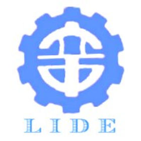
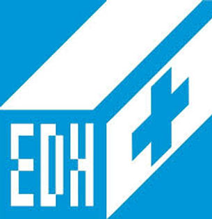
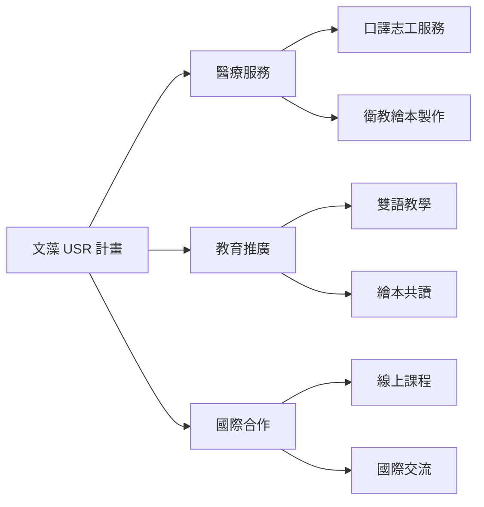

# 合作夥伴

我們與多個醫療機構、教育單位及國際組織建立長期合作關係，共同推動社會實踐計畫。

---

## 醫療夥伴

{ .partner-logo }

### 高雄榮民總醫院

與文藻僅隔幾條路有「鄰居」之稱的高雄榮民總醫院，於 **2016 年 10 月 01 日**與文藻外語大學結緣，並開啟許多別具意義的志工服務與執行「溫暖白色巨塔的小螺絲釘」USR 社會實踐計畫。

[:octicons-link-external-16: 醫院官網](https://www.vghks.gov.tw/){ target="_blank" }

{ .partner-logo }

### 小港醫院

文藻外語大學與「不凡的港醫」小港醫院相遇始於 **2019 年 03 月 26 日**，並攜手建立志工服務與執行「溫暖白色巨塔的小螺絲釘」USR 社會實踐計畫。

[:octicons-link-external-16: 醫院官網](https://www.kmhk.org.tw/){ target="_blank" }

{ .partner-logo }

### 義大醫院

機緣下的巧合遇上五星級的義大醫院，於 **2019 年 09 月 01 日**文藻外語大學開啟了志工服務的另一段故事，並一同開創有溫馨及付出的志工服務與執行「溫暖白色巨塔的小螺絲釘」USR 社會實踐計畫。

[:octicons-link-external-16: 醫院官網](https://www.edah.org.tw/){ target="_blank" }

---

## 教育夥伴

{ .partner-logo }

### 高雄市在地學校

與高雄市多所國中小學合作，進行雙語教學與繪本推廣活動。

{ .partner-logo }

### 非營利教育組織

合作服務外國弱勢孩童，提升教育素養與學習機會。

---

## 國際夥伴

{ .partner-logo }

### 柬埔寨教育機構

因為網路的連結，台柬線上英文課程突破地理限制，讓文藻國際英語志工們將愛與教育傳遞到柬埔寨。

{ .partner-logo }

### 國際志工組織

與各國志工團體合作，共同推動國際服務學習計畫。

---

## 合作模式

---

## 成為合作夥伴

如果您的組織有興趣與我們合作，歡迎與我們聯繫：

[:material-email: 聯絡我們](contact.md){ .md-button .md-button--primary }
