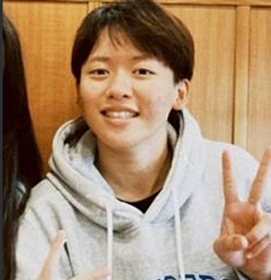

# 計畫團隊 Project Team

## 主持團隊

文藻小螺絲釘 USR 計畫由跨領域教師團隊共同推動，整合校內外資源，致力於大學社會責任實踐。

---

## 核心成員

### 計畫主持人
**趙靜雅**

負責計畫整體規劃、資源整合與對外聯繫，確保計畫目標達成。

### 共同主持人
**林虹秀**

協助主持人推動計畫執行，負責特定領域的專業指導與品質把關。

### 協同主持人
**周春曉**

支援各項子計畫執行，協調跨單位合作事宜。

### 協同主持人
**Emma**

支援各項子計畫執行，協調跨單位合作事宜。

---

## 跨領域教師社群

計畫整合校內 7 個系所中心、10+ 位教師共同開課：

- **外語教學**：英語、日語、法語、西語等外語專業
- **翻譯口譯**：口筆譯技巧與醫療口譯專業訓練
- **資訊科技**：IT 應用與數位工具開發
- **服務學習**：跨文化溝通與服務領導課程

---

## 合作夥伴

### 醫療機構
- 義大醫院
- 高雄榮民總醫院
- 小港醫院

### 教育單位
- 蚵寮國小
- 蚵寮國中
- 馬來西亞沙勞越學校

### 國際組織
- 柬埔寨服務據點

---

## 加入我們

歡迎有熱情、有行動力的師生加入小螺絲釘團隊！

[:material-arrow-right: 查看招生資訊](join.md){ .md-button .md-button--primary }
